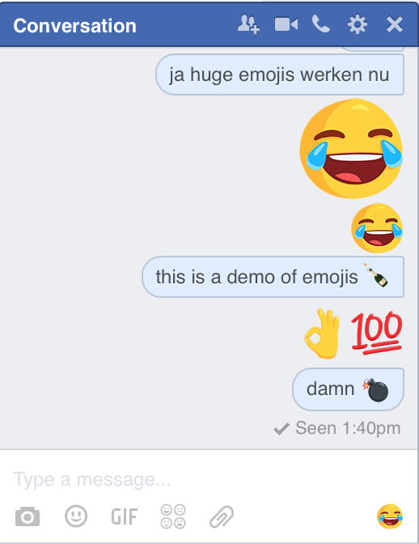
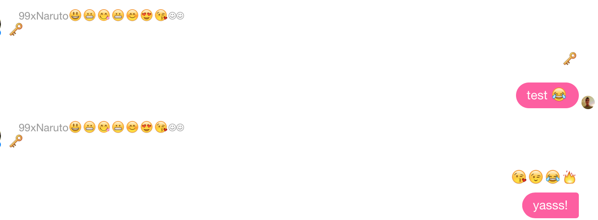

# No Facebook Emojis

Well just as a lot of you, I dislike the new Facebook emojis quite a bit. So I made a browser extension that replaces it with regular old unicode emojis.

# Why?

I think this is clear?

before|after
---|---
 | 

As you can see, from nice emojis, our conversation partner went online, that's a huge improvement!

# Installation

## Safari

Right now I don't have a dev license from Apple, but if anyone of you knows how to properly distribute without shelling out $99, let me know!

## Chrome

not yet

# Bugs

Maybe, let me know

# Support

Browsers:

* Safari
* ... port the script yourself
